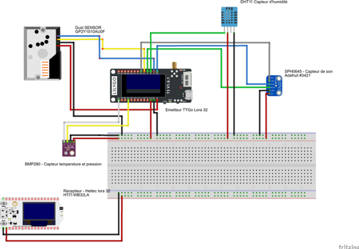

# T-IOT-902

> _Un projet de développement d'un émetteur / récepteur de données communicant en LoRa. L'émetteur aggrège des données
de capteurs météorologiques et les transmet à un récepteur qui les affiche sur un écran LCD, les stocke dans une base de
> données et les affiche sur une interface de monitoring web tout en publiant les données sur sensor.community._

## Sommaire

- [Groupe](#groupe)
- [Le projet](#le-projet)
  - [Contexte](#contexte)
  - [Architecture](#architecture)
  - [Technologies](#technologies)
- [Documentation](#documentation)
  - [Capteurs](#capteurs)
  - [ICD](#icd)
  - [Schéma de cablage](#schéma-de-cablage)

## Groupe

Le groupe ayant réalisé l'ensemble du travail de recherche et de développement est composé de 5 membres :
- Clément MATHÉ
- Nicolas SANS
- Eliott CLAVIER
- Mathis RAGOT
- Ewen PINSON

## Le projet

### Contexte

Le projet __T-IOT-902__ a pour but d'améliorer un firmware existant permettant de récupérer des données de capteurs et
de les publier sur sensor.community. Le firmware est actuellement fonctionnel mais ne permet pas d'utiliser tous les 
capteurs à notre disposition. De plus, le projet induit de devoir récuperer ces données depuis un émetteur LoRa et de les
transmettre à une gateway LoRa qui les enverra à sensor.community ainsi qu'à une base de données locale.

Pour répondre à cette problématique, une architecture de type SOLID a été mise en place. Cela permet de séparer les
différentes fonctionnalités du projet en plusieurs modules indépendants, réutilisables et permettant la scalabilité du
projet. 

### Architecture

Le projet s'architecture selon les éléments suivants :
- Un émetteur LoRa, connecté à des capteurs météorologiques, qui envoie les données à une gateway LoRa. Les capteurs
utilisés sont les suivants :
    - Un capteur de température et de pression atmosphérique (BMP280)
    - Un capteur d'humidité (DHT11)
    - Un capteur de qualité de l'air (WaveShare GP2Y1010AU0F)
    - Un capteur sonore (SPH0645LM4H)
- Une gateway LoRa, qui reçoit les données de l'émetteur et les transmet à une API REST grâce à un connexion WiFi et HTTP.
- Une API REST, qui reçoit les données de la gateway et les stocke dans une base de données tout en publiant les données
sur sensor.community.
- Une interface de monitoring web, qui affiche les données stockées dans la base de données.

__Concernant l'émétteur et la gateway LoRa__, quelques aspects du firmware sont à noter :
- L'utilisation du deepsleep pour économiser la batterie
- La configuration des firmwares à travers le fichier config.ini utilisé lors de la compilation, permettant
de synchroniser les échanges LoRa entre l'émetteur et la gateway ainsi que la serialisation / deserialisation des données
- La gateway stockent les paquets reçus dans une file d'attente avant de les envoyer à l'API REST. Cette queue est réalisée
en utilisant FreeRTOS et une FIFO.

### Technologies

Le projet utilise les technologies suivantes :
- C++ pour les firmware des émetteurs et de la gateway
- Rust pour l'API REST
- InfluxDB pour le stockage de données temporelles
- Grafana pour l'interface de monitoring web

Afin de faciliter le développement, le projet utilise les outils suivants :
- PlatformIO pour le développement des firmwares
- Doxygen pour la génération de la documentation du code
- Codecov pour la visualisation de la couverture de code des tests générés sur les firmwares et l'API
- GitHub Actions pour l'intégration continue. Les workflow permettent de build les firmwares et l'API, de lancer les tests,
de publier les résultats sur Codecov et de générer la documentation du code. Le tout est également mis à dispostion
sous forme d'artifacts.
- Docker et docker-compose pour lancer facilement l'API, la base de données et l'interface de monitoring web en local.
Des scripts `start_app.sh` et `stop_app.sh` permettent de lancer et d'arrêter l'ensemble des services. A noter que le
dossier `grafana` est monté en volume pour permettre la persistance des données. Il contient les dashboards relatifs
au projet, accessibles une fois docker-compose lancé.

## Documentation

### Capteurs

Une documentation des capteurs utilisés est disponible dans le dossier `docs`. Chacun des capteurs est décrit dans un
fichier markdown dédié. Parmi les informations disponibles, on retrouve le pinout, le protocole de communication utilisé
par le capteur, et des informations relatives à la configuration et à la capacité du capteur. Ces documents ont servi
de base pour le développement des firmwares et de benchmark pour comparer la consommation d'énergie des capteurs.

### ICD

Un ICD présent dans le dossier `docs` décrit la façon dont l'émetteur transmet les données à la gateway. Il permet de décomposer
les paquets de données envoyés par l'émetteur et de les décrire. Chacun des paquets est composé de plusieurs champs,
concaténés les uns aux autres en bits qu'il faut pouvoir traduire en données exploitables par la gateway.

### Schéma de cablage

## Installation

### IoT

Pour installer les firmwares sur les émetteurs et la gateway, il suffit de cloner le projet et de lancer PlatformIO.
Des extensions pour Visual Studio Code ainsi que la suite Jetbrains sont disponibles pour faciliter le développement.
Ces extensions reconnaissent les fichiers de configuration PlatformIO et permettent de compiler et de flasher les firmwares
sur les cartes.

### API REST

Pour lancer l'API REST, il suffit de cloner le projet et de lancer la commande `cargo run` à la racine du projet.

Pour installer les dépendances, il est nécessaire d'avoir installé Rust et Cargo. [Pour cela, il suffit de suivre les
instructions disponibles sur le site officiel de Rust.](https://www.rust-lang.org/fr/tools/install)

